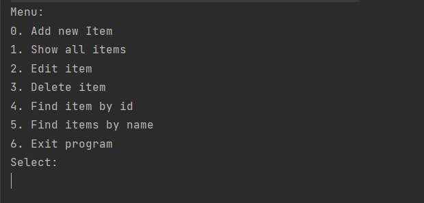
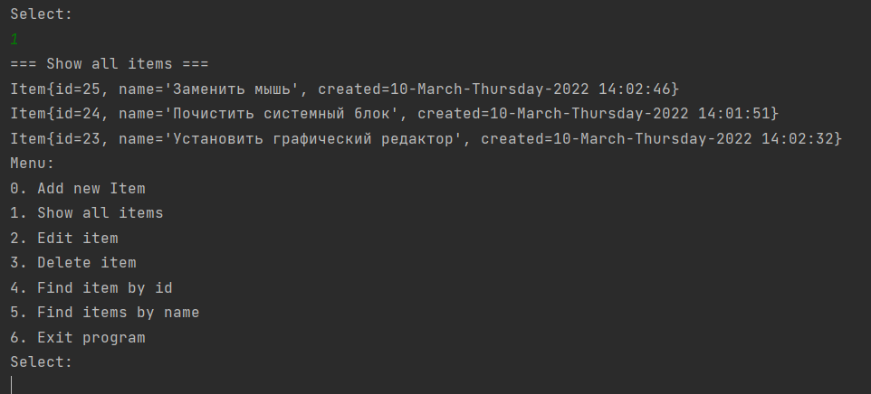
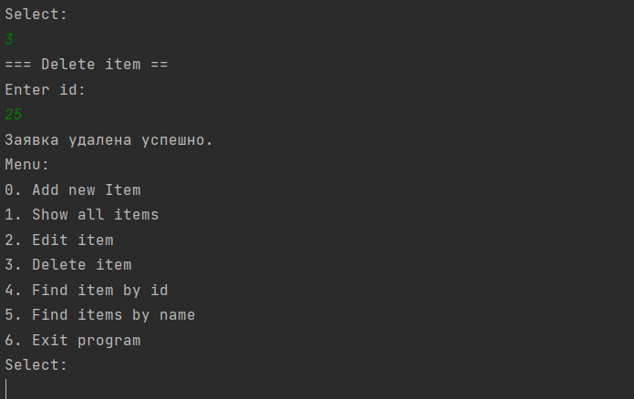

# job4j_tracker

## О проекте

Трекер задач.

## Внешний вид

Главное меню

Листинг всех задач.

Удаление задачи.

## Настройка и сборка

Настройки приложения содержатся в файле /src/main/resources/hibernate.cfg.xml.

Сборка приложения осуществляется командой: mvn package.

Перед запуском приложения следует создать базу данных и настроить ее в соответсвии с файлом hibernate.cfg.xml.

## Контакты

Email: kostasc@mail.ru
Telegram: @rkostashchuk